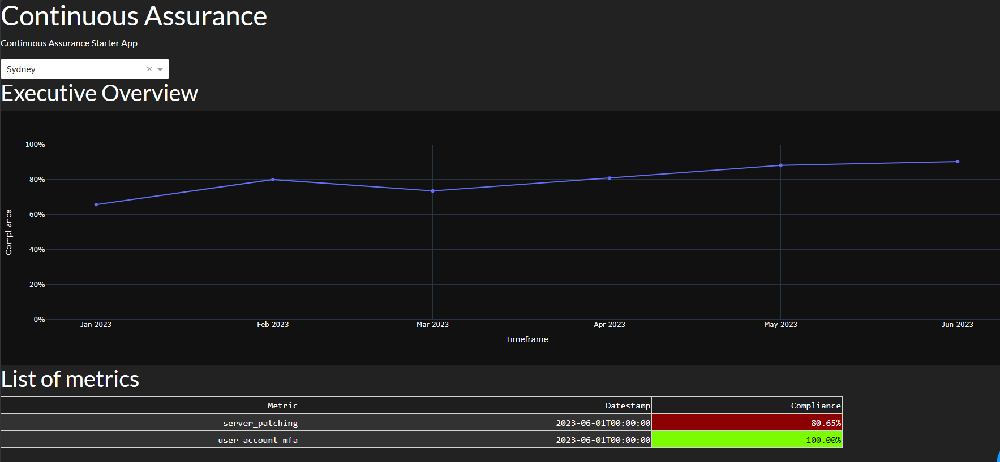

# continuous-assurance
Continuous Assurance Starter Template

## About this template

This is a continuous assurance compliance report starter kit platform, built with Python and Flask with Dash.



## Quick start

* Generate some dummy metrics
* Run it through a "pipeline"
* Render it on a reporting engine

Do it all by simply running:
```
$ git clone https://github.com/massyn/continuous-assurance
$ cd continuous-assurance
$ pip install -r requirements.txt
$ sh run.sh
```

Open your web browser to [http://localhost:8050](http://localhost:8050)